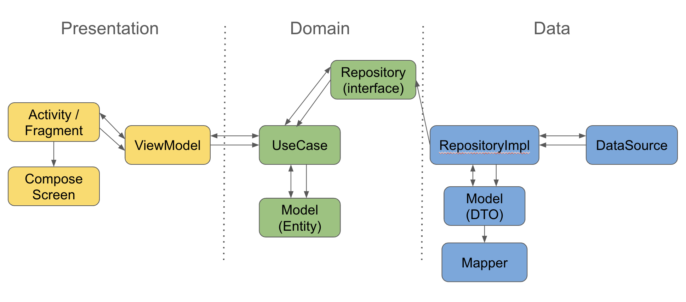

# Media Search App
===============================

사용한 라이브러리
--------------
* Glide : 이미지 라이브러리
* Hilt : DI
* Retrofit : 네트워크
* Okhttp: 네트워크
* Gson : Json Data 처리
* Coroutine : 비동기 처리

프로젝트 구조
---------------------
* 구조 : Clean Architecture를 멀티 모듈로 구현 app, data, domain, presentation
    * app : di, MediaSearchApplication
    * data : 네트워크, 로컬 데이터 처리
    * domain : 비즈니스 로직
    * presentation : UI 처리

정리
--------------------

구조 : Clean Architecture를 멀티 모듈로 구현 app, data, domain, presentation

